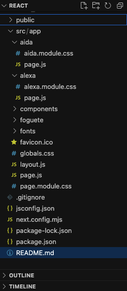
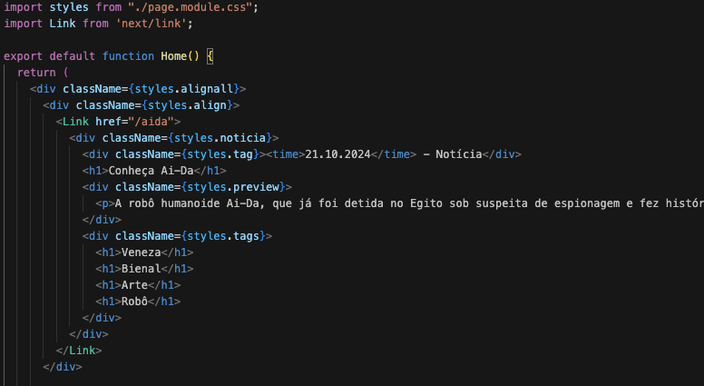
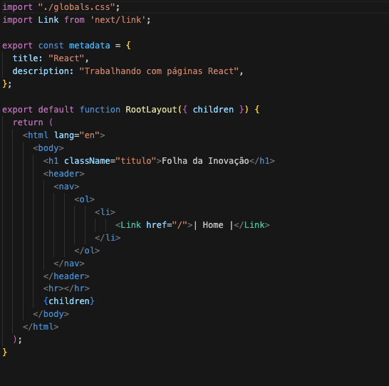
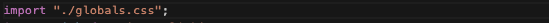
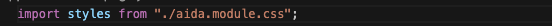
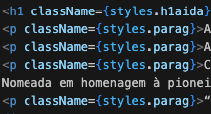

# Entendendo projeto em NextJS

Este projeto foi desenvolvido utilizando Next.js, um framework React utilizado para a criação de aplicações web. Em seguida, encontrará uma explicação da estrutura de diretórios e arquivos do projeto.

## 1. Criando um projeto NextJS



Caso não possua um projeto NextJS, você precisará ter o Node.js instalado em sua máquina, e deverá executar o seguinte comando em seu Terminal:

```
npx create-next-app@latest
````

Após feito, você deverá:

1. Adicionar em seu projeto as pastas /aida, /alexa, e /foguete

2. Criar um arquivo "page.js" em cada uma delas

3. Criar seus respectivos CSS em módulo ".module.css"

## 2. Codificando o projeto

### Página inicial:



No arquivo src/app/pages.js,  proveniente da criação do nosso projeto NextJS você precisará:

Realizar a importação dos estilos de page.module.css para aplicar estilo ao layout da página.

O componente Link do Next.js será importado para permitir a navegação entre diferentes páginas da aplicação utilizando SPA (Single Page Application).

As divs "align" e "alignall" foram utilizadas para alinhar ao centro da página e utilizar espaçamento para o conteúdo principal.

Os cards de notícias apresentam um componente Link que direciona o usuário para uma página específica ao serem clicados.

A seguinte estrutura será utilizada em nossos cards:

Uma div composta pela tag <time> que indica a data e uma classificação do card como sendo uma "Notícia", utilizando um texto com formatação padrão sem ser envolvido por tag.

Um título (h1) que apresenta a notícia.

Um preview (p) é uma descrição breve do conteúdo da notícia.

Uma lista de tags (h1) que representa temas ou categorias relacionados à notícia.

### Página Layout:



Esta página contém nosso menu <header> e o título do website, que serão exibidos em todas as páginas da aplicação.

O componente Link do Next.js também será importado para permitir a navegação entre diferentes páginas da aplicação utilizando SPA (Single Page Application).

## 3. Utilizando CSS

Para a aplicação dos estilos, serão criadas classes nos arquivos de páginas, para efetuar a aplicação. Assim como será feita a seleção de elementos padrão.

### CSS Global:

O CSS Global é utilizado quando você deseja aplicar estilos em toda a aplicação, sem restrições de escopo.



No Next.js, o CSS global será importado no arquivo layout.js. Isso assegura que os estilos globais sejam carregados e aplicados em todas as páginas da aplicação.

### CSS Modules:

Os CSS Modules são utilizados para aplicar estilos locais, ou seja, os estilos são automaticamente encapsulados no componente de origem, o que evita que os estilos sejam transferidos para outros componentes.



Para utilizar o CSS Modules, basta criar arquivos de estilo com a extensão.module.css. Estes arquivos podem ser importados diretamente para o componente em que deseja aplicá-los.

### Diferença entre os CSS:

O CSS Global afeta a aplicação inteira. Não é encapsulado, então poderá ocasionar conflitos de estilo. É utilizado para definir estilos que se aplicam globalmente.

O CSS Modules encapsula os estilos, prevenindo conflitos entre os componentes. Cada classe ou ID que é criada em um arquivo.module.css é automaticamente "escopado" para o componente para o qual foi importada.



Diferentemente da aplicação de um CSS comum, que são utilizadas aspas duplas envolvendo o nome de uma classe, a seleção é feita atráves de chaves e o prefixo "styles." será inserido na frente dos nomes das classes.


